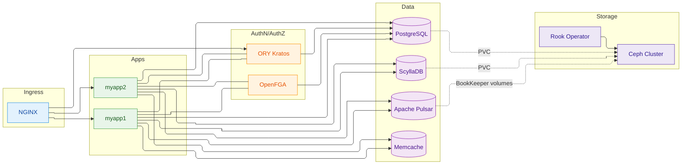
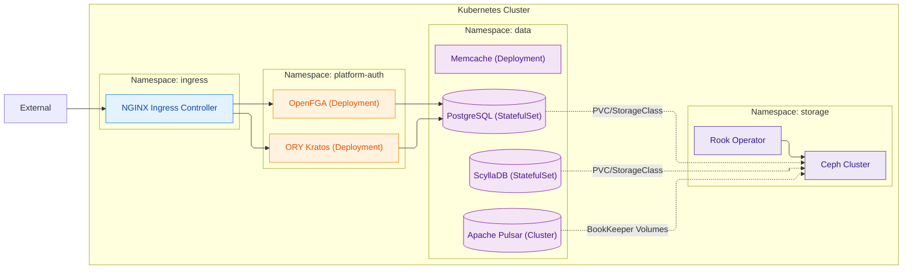

## 인프라 다이어그램

```mermaid
%%{init: { 'flowchart': { 'curve': 'linear' }, 'layout': 'elk' } }%%
flowchart LR
	subgraph Ingress
		NGINX["NGINX"]
	end

	subgraph "AuthN/AuthZ"
		KRATOS["ORY Kratos"]
		OPENFGA["OpenFGA"]
	end

	subgraph Apps
		APP1["myapp1"]
		APP2["myapp2"]
	end

	subgraph Data
		POSTGRES[("PostgreSQL")]
		SCYLLA[("ScyllaDB")]
		PULSAR[("Apache Pulsar")]
		MEMCACHE[("Memcache")]
	end

	subgraph Storage
		ROOK["Rook Operator"]
		CEPH["Ceph Cluster"]
	end

	%% Ingress routes
	NGINX --> APP1
	NGINX --> APP2
	NGINX --> KRATOS

	%% App to Auth
	APP1 --- KRATOS
	APP2 --- KRATOS
	APP1 --- OPENFGA
	APP2 --- OPENFGA

	%% Auth backends
	KRATOS --> POSTGRES
	OPENFGA --> POSTGRES

	%% App data deps
	APP1 --> POSTGRES
	APP1 --> SCYLLA
	APP1 --> PULSAR
	APP1 --> MEMCACHE

	APP2 --> POSTGRES
	APP2 --> SCYLLA
	APP2 --> PULSAR
	APP2 --> MEMCACHE

	%% Storage relationships
	ROOK --> CEPH
	POSTGRES -. "PVC" .-> CEPH
	SCYLLA -. "PVC" .-> CEPH
	PULSAR -. "BookKeeper volumes" .-> CEPH

	%% Optional styling for readability
	classDef ingress fill:#e3f2fd,stroke:#1e88e5,color:#0d47a1;
	classDef apps fill:#e8f5e9,stroke:#43a047,color:#1b5e20;
	classDef auth fill:#fff3e0,stroke:#fb8c00,color:#e65100;
	classDef data fill:#f3e5f5,stroke:#8e24aa,color:#4a148c;
	classDef storage fill:#ede7f6,stroke:#5e35b1,color:#311b92;

	class NGINX ingress
	class APP1,APP2 apps
	class KRATOS,OPENFGA auth
	class POSTGRES,SCYLLA,PULSAR,MEMCACHE data
	class ROOK,CEPH storage
```

## Kubernetes 상의 인프라 아키텍처

```mermaid
%%{init: { 'flowchart': { 'curve': 'linear' }, 'layout': 'elk' } }%%
flowchart LR
	subgraph "Kubernetes Cluster"
		direction LR

		subgraph "Namespace: ingress"
			NGINX_IC["NGINX Ingress Controller"]
		end

		subgraph "Namespace: platform-auth"
			KRATOS_DEP["ORY Kratos (Deployment)"]
			OPENFGA_DEP["OpenFGA (Deployment)"]
		end

		subgraph "Namespace: data"
			POSTGRES_STS[("PostgreSQL (StatefulSet)")]
			SCYLLA_STS[("ScyllaDB (StatefulSet)")]
			PULSAR_CLUSTER[("Apache Pulsar (Cluster)")]
			MEMCACHE_DEP["Memcache (Deployment)"]
		end

		subgraph "Namespace: storage"
			ROOK_OP["Rook Operator"]
			CEPH_CLUSTER["Ceph Cluster"]
		end
	end

	%% External entry
	EXTERNAL["External"] --> NGINX_IC

	%% Ingress to platform services
	NGINX_IC --> KRATOS_DEP
	NGINX_IC --> OPENFGA_DEP

	%% Auth platforms to data backends
	KRATOS_DEP --> POSTGRES_STS
	OPENFGA_DEP --> POSTGRES_STS

	%% Data services
	%% (example internal comms not expanded; infra focus only)
  
	%% Storage provisioning via Rook-Ceph
	ROOK_OP --> CEPH_CLUSTER
	POSTGRES_STS -. "PVC/StorageClass" .-> CEPH_CLUSTER
	SCYLLA_STS -. "PVC/StorageClass" .-> CEPH_CLUSTER
	PULSAR_CLUSTER -. "BookKeeper Volumes" .-> CEPH_CLUSTER

	%% Optional styling
	classDef ingress fill:#e3f2fd,stroke:#1e88e5,color:#0d47a1;
	classDef auth fill:#fff3e0,stroke:#fb8c00,color:#e65100;
	classDef data fill:#f3e5f5,stroke:#8e24aa,color:#4a148c;
	classDef storage fill:#ede7f6,stroke:#5e35b1,color:#311b92;

	class NGINX_IC ingress
	class KRATOS_DEP,OPENFGA_DEP auth
	class POSTGRES_STS,SCYLLA_STS,PULSAR_CLUSTER,MEMCACHE_DEP data
	class ROOK_OP,CEPH_CLUSTER storage
```

