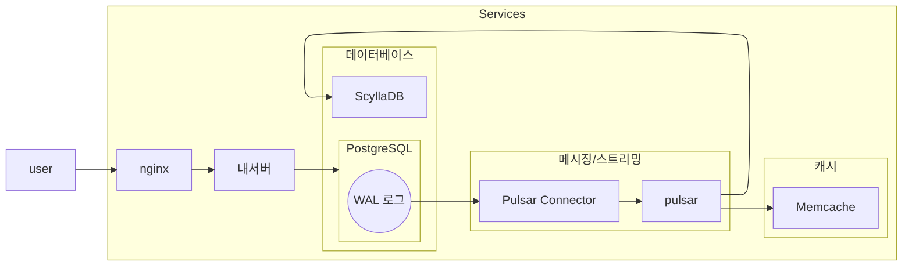

# flow

```mermaid
---
config:
    layout: elk
    flowchart:
        curve: catmullRom
---
graph LR

    User[user] --> Nginx[nginx]

    subgraph Postgres["PostgreSQL"]
        direction TB
        WAL((WAL 로그))
    end

    subgraph Services
        subgraph database[데이터베이스]
            Postgres[PostgreSQL]
            Scylla[ScyllaDB]
        end

        subgraph messagine[메시징/스트리밍]
            Pulsar[Apache Pulsar]
            WAL --> PulsarConnector[Pulsar Connector]
        end

        subgraph cache[캐시]
            Memcache[Memcache]
        end

        Nginx --> AppServer[내서버]
        AppServer --> Postgres

        PulsarConnector --> Pulsar[pulsar]
        Pulsar --> Scylla[ScyllaDB]
        Pulsar --> Memcache[Memcache]
    end

```

pulsar-connector가 Postgres의 WAL 로그를 읽어 Apache Pulsar로 스트리밍하고, ScyllaDB, Memcache에 접근하는 구조입니다.
- ScyllaDB : table log로 client와 데이터 동기화
- Memcache : 캐시 동기화
